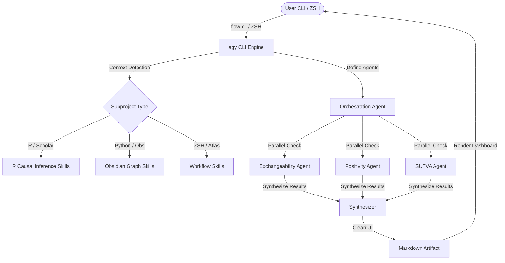
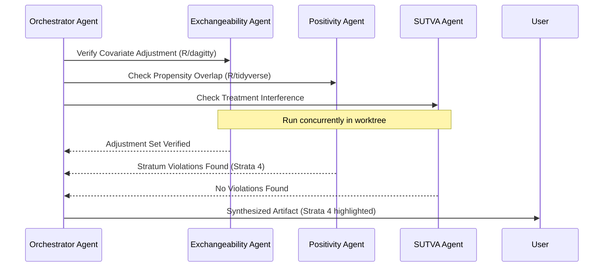

# ⚡️ Specification: Antigravity (agy) CLI Optimization & Extension Architecture

This specification outlines the architecture to optimize the **agy** CLI, leveraging design patterns from the Claude `craft` plugin (109 commands, 38 skills, 8 agents). It is customized for an ADHD developer workflow in an R-centric causal inference and multi-project hub-and-spoke workspace (`dev-tools`).

---

## 🎯 Executive Summary (BLUF)
*   **The Problem:** High cognitive overhead of navigating 25+ independent subprojects, coupled with context-switching during statistical modeling (causal graph analysis, R packaging).
*   **The Solution:** Optimize **agy** by implementing **Context-Aware Adaptive Skills** (auto-loaded per subproject), **Parallel Agent Orchestration** (multi-threaded validation), and **Artifact-Driven UI** to eliminate terminal clutter and accommodate ADHD focus.

---

## 🏗️ Architecture Diagram: Hub-and-Spoke Integration

---

## 📦 Extension Layers

### 1. Plugins: System Integration
Plugins extend the core capabilities of `agy` by adding system-level tools.

> [!IMPORTANT]
> **In-Process Architecture (rforge Model):** Following `rforge` v1.3.0+, `agy` deprecates external JSON-RPC MCP servers for local tasks to avoid network latency. Plugins are fully self-contained modules loaded directly into the `agy` Python process, keeping startup times under $T < 10\text{ms}$.

*   **`agy-obs` (Obsidian Knowledge Bridge):**
    *   Integrates directly with the SQLite database of [obsidian-cli-ops](file:///Users/dt/projects/dev-tools/obsidian-cli-ops).
    *   Allows `agy` to run semantic note lookups, identify duplicate research notes, and find gaps in statistical literature.
*   **`agy-rforge` (R Package Harness):**
    *   Exposes in-process commands to execute `devtools::check()`, `devtools::test()`, and resolve package dependencies.
    *   Automates Roxygen2 documentation validation.
*   **`agy-atlas-hub` (State Hub Interface):**
    *   Bridges `agy` sessions with the [atlas](file:///Users/dt/projects/dev-tools/atlas) state database to track current goals, active sessions, and recent breadcrumbs.

---

### 2. Skills: Context-Activated Workflows
Inspired by `craft`'s context-activated skills, `agy` will load skills dynamically based on the current working directory ($CWD$) without manual user configuration.

| Skill | Activation Trigger | Purpose |
|---|---|---|
| **`causal-proof`** | Files containing `ggdag`, `dagitty`, `targets` | Step-by-step verification of the three observational study pillars (Positivity, Exchangeability, SUTVA). |
| **`dag-compiler`** | Quarto files (`.qmd`) or R files | Generates `ggdag` or `dagitty` R code from a textual description of variables and paths. |
| **`session-wrap`** | Global | Automates workspace updates: logs session to `~/.config/obs/obs.log`, updates `.STATUS` file, and drafts git commit messages. |

> [!NOTE]
> **Causal Math Verification Example:**
> When verifying SUTVA, the skill checks that the treatment assignment of individual $i$, denoted by $W_i$, uniquely determines their potential outcome:
> $$Y_i(W) = Y_i(W_i)$$
> It flags potential violations such as interference or multiple versions of treatment in the study design.

---

### 3. Artifacts: Distraction-Free UI
To accommodate ADHD developers, `agy` utilizes live-updating markdown artifacts to minimize terminal scrollback and focus-hijacking text wall.

*   **DAG Visualization Panels:** Renders clean ASCII or Mermaid graphs in the sidebar instead of raw terminal code blocks.
*   **Covariate Balance Dashboards:** Outputs propensity score overlap plots and standardized mean differences ($SMD$) in a single, updating table.
*   **Active Status Cards:** Displays a scannable, high-level summary of the active project and next steps.

---

### 4. Agents: Parallel Subagents
Instead of waiting for sequential tasks, the orchestrator delegates to specialized subagents using parallel execution.

---

## 🚀 Optimization Suggestions for agy CLI

### ⚡ ADHD-Friendly Command Output (Progressive Disclosure)
*   **The Pattern:** Don't dump 500 lines of compiler errors.
*   **The Optimization:** Group warnings and errors by file. Keep terminal output under 15 lines. Place the full log in a dedicated [obs.log](file:///Users/dt/.config/obs/obs.log) file, and show a summary artifact.

### 🧠 Semantic Worktree Caching (Virtual Workspace)
*   **The Pattern:** Subagents can take minutes to spin up and load conventions.
*   **The Optimization:** Use `git worktree` templates prepopulated with R and Python environments. This reduces agent startup time from $~30$ seconds to under $3$ seconds, matching `flow-cli` sub-10ms response expectations.

### 🔄 Bidirectional Session Sync
*   **The Pattern:** The user works in `flow-cli` (`work medrobust`) and then starts `agy`.
*   **The Optimization:** `agy` reads `~/.atlas/sessions.yaml` on startup. It automatically starts in the context of the user's active session, matching the current project scope and loading the correct `CLAUDE.md`.
