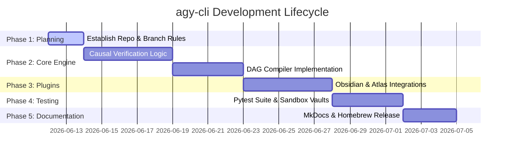

# SPEC: agy-cli Implementation & Release Roadmap

This specification outlines the phases to plan, execute, test, and document the **agy-cli** project. It is structured to follow the ADHD-optimized, self-contained plugin paradigm.

---

## 🎯 Executive Summary (BLUF)
*   **Target:** A fully functioning CLI stats assistant and workspace manager within 4 development sprints.
*   **Core Goals:** Establish $T < 10\text{ms}$ local execution speed, support causal graphs ($\text{ggdag}$/$\text{dagitty}$), check study assumptions, and integrate with Obsidian/Atlas.

---

## 🗺️ Sprints and Milestones

---

## 📦 Phase Details

### Phase 1: Planning & Architecture (Current)
*   **Goal:** Set repository conventions and establish branch protections.
*   **Deliverables:**
    *   [x] Initialize Git with single-integration baseline, upgraded to multi-branch ($\text{main} \leftarrow \text{dev} \leftarrow \text{feature/*}$).
    *   [x] Set local [CLAUDE.md](file:///Users/dt/projects/dev-tools/agy-cli/CLAUDE.md) rules and branch protections.
    *   [x] Create [docs/specs/SPEC-agy-cli-optimization.md](file:///Users/dt/projects/dev-tools/agy-cli/docs/specs/SPEC-agy-cli-optimization.md).

### Phase 2: Core Execution (The Causal Inference Engine)
*   **Goal:** Implement the math validation routines and DAG compilers.
*   **Tasks:**
    *   [ ] **R Process Bridge:** Create an in-process subprocess wrapper to spawn R sessions and load `tidyverse`, `ggdag`, and `dagitty`.
    *   [ ] **Assumption Verifier (`agy eval`):** Write algorithms to verify:
        *   **Positivity:** Parse dataset columns to verify non-zero probabilities: $0 < P(W=1|X) < 1$.
        *   **Exchangeability:** Check that the backdoor path is blocked: $Y(w) \perp\!\!\perp W \mid X$.
    *   [ ] **DAG Compiler (`agy dag`):** Convert string descriptions (e.g., `W -> Y, X -> W, X -> Y`) into `dagitty` formatting and render ASCII visualization in terminal.

### Phase 3: Plugin Integrations (In-Process Spreads)
*   **Goal:** Integrate workspace tracking and knowledge graphs.
*   **Tasks:**
    *   [ ] **`agy-obs`:** Add SQLite queries targeting [obsidian-cli-ops](file:///Users/dt/projects/dev-tools/obsidian-cli-ops) schema to find unlinked notes or high-centrality research nodes.
    *   [ ] **`agy-atlas-hub`:** Implement a YAML reader for `~/.atlas/` to synchronise active work sessions with ZSH environments.

### Phase 4: Testing Harness (Safety Gates)
*   **Goal:** Enforce test coverage ($>80\%$) and ensure regression safety.
*   **Tasks:**
    *   [ ] **Unit Tests:** Implement unit tests under `tests/` covering parsing logic, DAG translation, and SQLite schema mappings.
    *   [ ] **Sandbox Vaults:** Generate virtual test directories containing dummy Markdown files and datasets to run end-to-end (E2E) integration checks.

### Phase 5: Documentation & Distribution (Publishing)
*   **Goal:** Deploy clear guides and set up installation.
*   **Tasks:**
    *   [ ] **MkDocs:** Configure `mkdocs.yml` using the Material theme, detailing the causal workflow guides.
    *   [ ] **Man Page:** Create a Unix man page `agy.1` to document all CLI commands.
    *   [ ] **Homebrew Tap:** Write a Ruby formula and integrate with GitHub release actions to distribute `agy-cli` via Homebrew.
